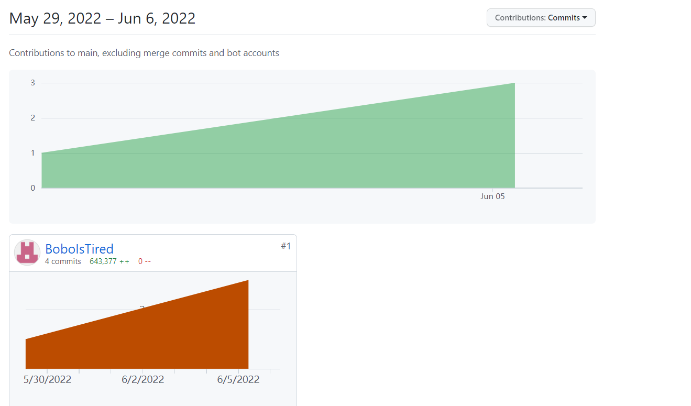

# 2021-2022学年第2学期
# **实 验 报 告**


- 课程名称:跨平台脚本开发技术  
- 实验项目:  期末大作业
- 专业班级_计算机1904__                      
- 学生学号__31901106_
- 学生姓名_丁枭波__
- 实验指导教师:郭鸣

## 实验内容


1. 项目分工表格

     

    | 姓名 |学号 |班级 |任务|权重|
    |:--|:--:|--:|--:|--:|
    | 丁枭波 | 31901106 | 计算1904 |      | 1.0 |

    

1. 项目自我评估表

     

    | 技术点          | 自评等级:(1-5) | 备注 |
    |:--|:--:|:--|
    | 响应式编程      |3| 前端展示的数据会随着数据库数据变化而更新                     |
    | 函数式编程      |4| vue将各个阶段调用的函数作为对象属性输出，编写函数式组件调用，其中数据多使用JSON包返回 |
    | 模块，require规则 | 3 | 在node.js后台中，模块化数据库层和接口层的文件，接口层调用数据库层，app.js调用接口层，使用require和import函数实现了各类库的调用 |
    | http xhr promise cookie | 4 | 后端接口类型基本为get和post，通过req.query获取通过url传递的数据，前端使用axios异步调用接口 |
    | xx框架 | 4 | 使用express框架 |
    
1. 项目说明

    1. 项目由node.js后端和vue前端组成，后端使用express框架，用sequelize框架实现对数据库操作，前端使用vue3，用js编写，部分使用了vant和element-plus的组件。
       
        项目主要有登录、注册界面，个人资料显示、修改，好友信息、搜索添加好友，其他信息展示的和搜索功能和对应界面。
        
        - 首页：
        
          ```js
          onMounted(() => {
                 axios({
                  method:'get',
                  url:'/hero',
                  // params:searchWord,
                }).then(res=>{
                  store.commit('setHero',res.data)
                  store.commit('setSearch',res.data)
                  console.log(store.state.heroList)
                  state.heroList=store.state.heroList
                })
              })
          ```
        
          ```js
          //后端
          exports.findAll=(req,res)=>{
            Hero.findAll({
              order:[
                ['winRate','DESC']
              ],
          
            }).then((data)=>{
              res.send(data);
            })
          }
          ```
        
          在生命周期onMounted中使用axios调用接口获取数据，赋值给store中的数组，方便在其他界面使用。在后端的control中查询数据时就对数据做排序。
        
          搜索功能：
        
          ```js
          const onSearch = () => {
                console.log(keyWord)
                let searchWord ={
                  keyWord:keyWord.value
                  // keyWord.value:输入的内容
                }
                console.log(searchWord)
                 axios({
                  method:'get',
                  url:'/hero/search',
                  params:searchWord,
                }).then(res=>{
                  store.commit('setSearch',res.data)
                  console.log(store.state.searchList)
                  state.heroList=store.state.searchList
                })
              }
          ```
        
          ```js
          //后端
          exports.findBySearch=(req,res)=>{
            Hero.findAll({
              order:[
                ['winRate','DESC']
              ],
              where:{
                nickname:{
                  [Op.like]: '%'+req.query.keyWord+'%' ,
                }
              }
            }).then((data)=>{
              res.send(data);
              // console.log()
            })
          }
          ```
        
          输入搜索内容后对相关字段做模糊查询。
        
          
        
        - 个人界面
        
          登录：
        
          ```js
          const onLogin = () => {
                // console.log(username)
                // console.log(password)
                let loginMsg ={
                  username:username.value,
                  password:password.value
                  // keyWord.value:输入的内容
                }
                console.log(loginMsg)
                 axios({
                  method:'get',
                  url:'/user/login',
                  params:loginMsg,
                }).then(res=>{
                  store.commit('setUser',res.data)
                  console.log(store.state.user)
                  state.user=store.state.user
                  // state.user = res.data
                  // console.log(state.user)
                  if(res.data){
                    store.commit('setLogin')
                    router.push('/me')
                  }else{
                    Toast("用户名或密码错误!")
                  }
                })
                // $router.push('/me')
              }
          ```
        
          对个人信息界面做了路由守卫，在未登陆之前，点击个人信息界面会跳转到登录界面，登录功能其实是一个查询功能，登录成功会返回账号的信息。
        
          个人信息界面：
        
          ```js
          onMounted(() => {
                // console.log(store.state.heroList)
                state.user=store.state.user
                let msg={
                  userNickname:state.user.userNickname
                }
                //获取好友申请
                axios({
                  method:'get',
                  url:'/friend/apply',
                  params:msg
          
                }).then(res=>{
                  store.commit('setApplyList',res.data)
                  // store.commit('setSearch',res.data)
                  console.log(store.state.applyList)
                  // state.heroList=store.state.heroList
                })
                //获取好友
                axios({
                  method:'get',
                  url:'/myfriend',
                  params:msg
          
                }).then(res=>{
                  store.commit('setFriendList',res.data)
                  // store.commit('setSearch',res.data)
                  console.log(store.state.friendList)
                  // state.heroList=store.state.heroList
                })
          
              });
          ```
        
          个人信息的onMounted阶段就从接口中获取好友信息
        
          修改头像：
        
          ```js
          const onRead = (file) => {
                    console.log(file)
                    let formData = new FormData()
                    formData.append('avatar', file.file)
                    formData.append('username',state.user.username)
                    console.log(formData.get("avatar"))
          
                    // axios.post('/user/upload', formData)
                    console.log(state.user.username)
                    
                    axios.post('/user/upload',formData).then(res=>{
                      console.log(res)
                    })
                  }
          ```
        
          将图片和用户信息以formData表单传输到后端。
        
          ```js
          //router
          const multer=require('multer');
          const upload = multer({ dest: "img/" })
          router.post("/upload", upload.single('avatar'),user.editUserImg)
          ```
        
          ```js
          //controller
          exports.editUserImg = (req, res) => {
          
            // console.log(1)
            const file = req.file
              
            console.log(path.parse(req.file.originalname).ext);
            let oldname = req.file.path //获取path
            let newname = req.file.path + path.parse(req.file.originalname).ext  
            fs.renameSync(oldname, newname) //重命名
            console.log('文件类型：%s', file.mimetype)
            console.log('原始文件名：%s', file.originalname)
            console.log('文件大小：%s', file.size)
            console.log('文件保存路径：%s', file.path)
          
          
            User.update(
              {
                userHeadUrl:'http://localhost:3000/'+file.filename+path.parse(req.file.originalname).ext  //修改数据库
              },
              {
                where:{
                  username:req.body.username
                }
            }).then((data)=>{
              res.send(data);
              // console.log()
            })
          
          
          }
          ```
        
          ```js
          app.use(express.static('./img/')); // 设置静态图片访问的路径
          ```
        
          后端用了multer作为中间件接受图片，并保存到后端项目的img文件夹中。再将新的图片url修改到数据库中，配置类静态资源之后，前端可以通过新的url拿到图片。
        
          
        
        - 好友界面
        
          好友申请：
        
          ```js
          const onSearch = () => {
                console.log(keyWord)
                let msg ={
                  host:store.state.user.userNickname,
                  guest:keyWord.value,
                  
                  // keyWord.value:输入的内容
                }
                console.log(msg)
                 axios({
                  method:'get',
                  url:'/friend/request',
                  // params:keyword,
                  params:msg
                  
                }).then(res=>{
                  console.log(res.data)
                })
              }
          ```
        
          前端发送申请后，会在好友申请表中生成带有主、客信息和申请状态信息（初始为1）的数据。
        
          在拒绝申请后状态 1=>2
        
          同意申请后状态 1=>0 ，并会在好友表中生成两条信息，分别对应相互的好友。
        
          
        
    1. 项目 是独立开发

1. 解决技术要点说明
    - ./config/db.config.js建立数据库连接
    
  ```js
      module.exports={
        HOST:"localhost",
        USER:"root",
        PASSWORD:"123",
        DB:"lol",
        dialect:"mysql",
      }
  ```

    - 用sequelize建模型
    
      ```js
      const { sequelize, Sequelize } = require(".");
      
      module.exports=(sequelize,Sequelize)=>{
        const Lol = sequelize.define("areadata",{
          areaName: {
            type: Sequelize.STRING
          },
          picUrl: {
            type: Sequelize.STRING
          },
          iconUrl: {
            type: Sequelize.STRING
          },


​      
​        })
​        return Lol
​      }
​      ```


​      
​    
​    - 引入路由
​    
      ```js
      require("./app/myroutes/hero.router")(app);
      require("./app/myroutes/area.router")(app);
      require("./app/myroutes/user.router")(app);
      require("./app/myroutes/friend.router")(app);
      require("./app/myroutes/myfriend.router")(app);
      ```


​      
​    
​    - 解析
​    
      ```js
      //用bodyParser解析
      app.use(bodyParser.json());
      app.use(bodyParser.urlencoded({extended: true}));
      ```


​      
​    
​    - 跨域配置
​    
      ```js
      //跨域
      const cors = require("cors")
      var corsOptions = {
        origin: "http://localhost:8080"
       // origin: "http://192.168.43.59:8080"
      }
      ```

1. 接口文档

     默认端口 localhost:3000/

     | 方法 | 接口                 | 参数         | 功能               |
     | ---- | -------------------- | ------------ | ------------------ |
     | post | /api/user            | 注册信息     | 注册               |
     | get  | /api/user/login      | 账号密码     | 登录               |
     | post | /api/user/update     | 昵称、密码   | 修改昵称、密码     |
     | get  | /api/user/url        | 昵称         | 搜索用户的头像     |
     | post | /api/user/upliad     | 头像、用户名 | 上传修改头像       |
     | get  | /api/hero            |              | 获取“英雄”信息     |
     | get  | /api/hero/search     | 搜索关键词   | 搜索英雄信息       |
     | post | /api/friend/request  | 搜索关键词   | 发送好友请求       |
     | get  | /api/friend/agree    | 用户昵称     | 同意好友请求       |
     | get  | /api/friend/refuse   | 用户昵称     | 拒绝好友请求       |
     | get  | /api/friend/apply    |              | 获取好友申请信息   |
     | post | /api/myfriend        | 主客用户昵称 | 生成好友关系表数据 |
     | get  | /api/myfriend        | 主 用户昵称  | 获取好友列表       |
     | post | /api/myfriend/update |              | 更新好友关系表     |

     

1. 心得体会（结合自己情况具体说明）

     - 大项目开发过程心得
       
       - 因为没有用node.js开发后端的经验，不知道如何开始
       
         解决：在B站寻找教程，学习express和Sequelize的使用
       
       - 在开发修改头像功能时，一开始想采用七牛云等图床平台完成，但与课程要求不符
       
         解决：用vant的upload组件上传，学习使用multer接受文件
    - 本课程建议
      
        - 课程本身难度合适，学习没有太多困难，但实验作业的难度较大，遇到的困难较多。建议可以对平时课程实验内容的讲解更加细致，帮助像我这样学习能力不够强的同学更快理解和实践。